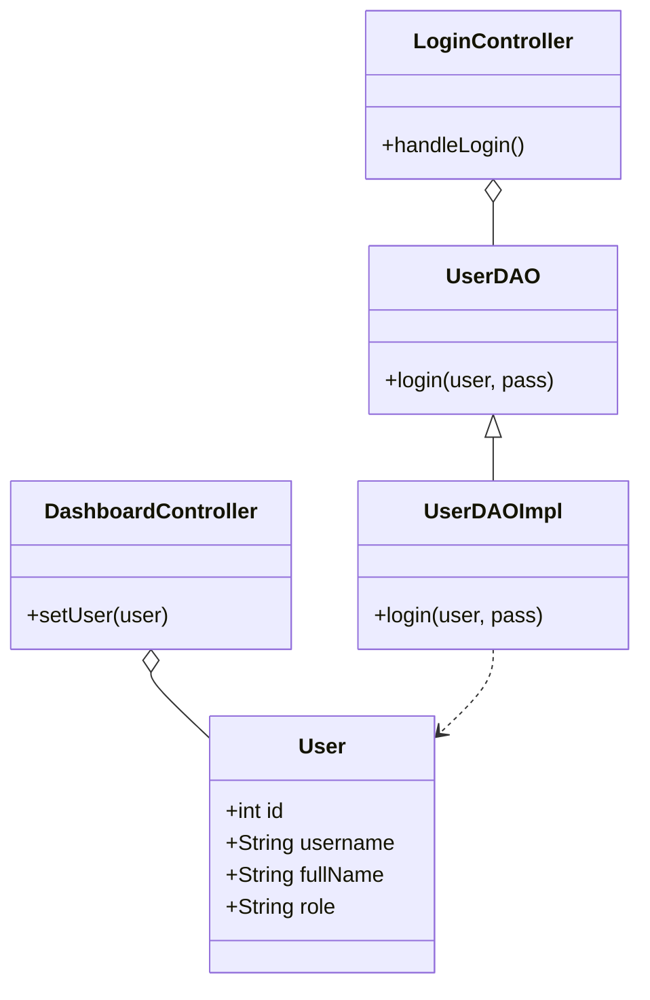
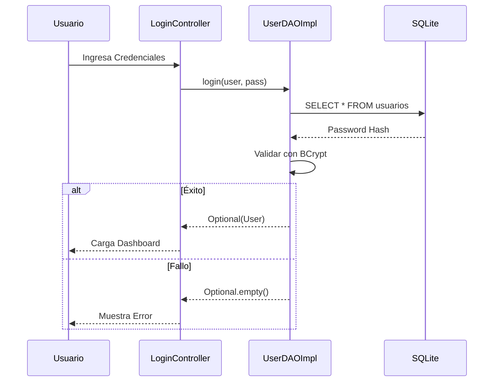

# INFORME TÉCNICO: SISTEMA DE GESTIÓN CLÍNICA AAUCA v1.0

Este informe detalla la arquitectura, el diseño y la implementación del sistema de autenticación dinámica para la Clínica Aauca.

## 1. Resumen Ejecutivo
Se ha desarrollado un sistema de escritorio multiplataforma (Windows nativo) que permite la gestión segura de accesos mediante roles. El sistema destaca por su interfaz moderna, seguridad basada en hasheo industrial (BCrypt) y una arquitectura modular escalable.

## 2. Diagramas de Arquitectura

### 📊 Diagrama de Clases (Patrón DAO)


### 🔐 Diagrama de Secuencia (Flujo de Autenticación)


## 3. Estructura del Proyecto (Estandarización Maven)
El proyecto sigue el estándar de Maven para facilitar su mantenimiento y escalabilidad futura.

```text
SGC/
├── src/main/java/               # Código Fuente Java
│   ├── com.clinica.aauca/       
│   │   ├── Launcher.java        # Punto de entrada para Fat JAR
│   │   ├── MainApp.java         # Clase Application (JavaFX)
│   │   ├── controller/          # Controladores (Login/Dashboard)
│   │   ├── dao/                 # Patrón Data Access Object
│   │   ├── model/               # Entidades (User)
│   │   └── util/                # DatabaseConnector
│   └── module-info.java         # Modularidad Java 17
├── src/main/resources/          # Recursos (Vista y Estilo)
│   ├── view/                    # Archivos FXML
│   ├── css/                     # Estilo CSS Moderno
│   └── sql/                     # Esquema SQL (schema.sql)
├── ClinicaAauca.exe             # Lanzador nativo compilado en C#
└── ClinicaAaucaFinal/           # Carpeta para distribución portable (con JRE)
```

## 4. Detalles de Implementación Técnica
*   **Java 17 LTS**: Uso de las últimas funcionalidades del lenguaje y modularidad.
*   **JavaFX 17**: Interfaz gráfica enriquecida con CSS personalizado.
*   **BCrypt (Strong Hashing)**: Las contraseñas se almacenan como hashes irreversibles mediante `jbcrypt`.
*   **SQLite JDBC**: Base de datos integrada que no requiere instalación en el cliente.
*   **C# Native Launcher**: Un ejecutable en C# que orquesta la carga del JRE interno para garantizar que el archivo `.exe` funcione en cualquier Windows.

---
