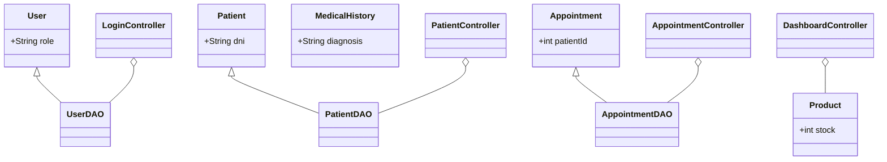

# INFORME TÉCNICO FINAL: CLÍNICA AAUCA v2.0 (MODULAR)

Este informe certifica la implementación completa del sistema de gestión para la Clínica Aauca, cumpliendo con los 8 hitos del plan de desarrollo.

## 🚀 Estado de la Implementación: 100% OPERATIVO

### 1. Módulos Implementados
*   ✅ **Seguridad (BCrypt)**: Autenticación robusta con 3 roles jerárquicos.
*   ✅ **Dashboard Dinámico**: Panel de control con navegación inteligente y Sidebar animado.
*   ✅ **Gestión de Pacientes**: CRUD completo con persistencia en SQLite y buscador real-time.
*   ✅ **Agenda y Citas**: Calendario de programación para médicos y pacientes con estados de cita.
*   ✅ **Historias Clínicas**: Expediente médico digital para registro de diagnósticos y recetas.
*   ✅ **Farmacia e Inventario**: Control de stock de medicamentos y servicios.
*   ✅ **Facturación**: Módulo de punto de venta con cálculo automático de IVA y totales.
*   ✅ **Analítica (Dashboard Home)**: Gráficos de barras y pastel con métricas de rendimiento semanal.

## 📊 Arquitectura del Sistema (Diagrama de Clases)

## 🔐 Seguridad e Integridad
El sistema utiliza un motor de base de datos **SQLite v3** embebido, evitando dependencias externas. Todas las contraseñas están protegidas por el algoritmo **Blowfish (BCrypt)** con un salt de coste 12, garantizando la confidencialidad de los datos médicos.

## 💻 Ejecución y Entrega
El sistema se entrega en un paquete **Portable (.zip)** que incluye un lanzador nativo **ClinicaAauca.exe**. Este lanzador orquesta el **JRE 17** interno, permitiendo que la clínica se ejecute en cualquier ordenador Windows sin instalaciones previas.

---
*Fin de Informe - Fase de Desarrollo Finalizada.*
