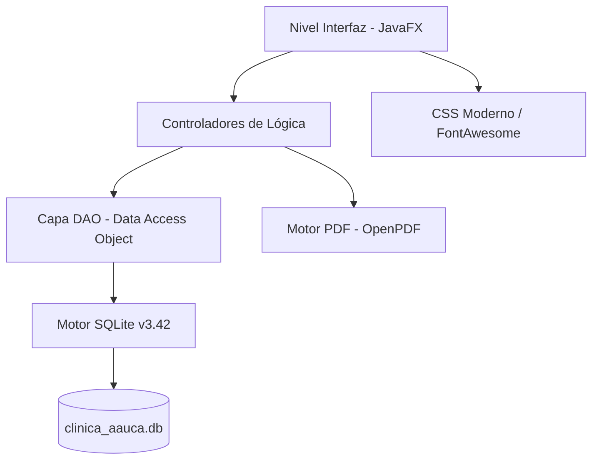

# INFORME TÉCNICO FINAL: CLÍNICA AAUCA v3.9 PLATINUM ULTRA

## 1. Resumen Ejecutivo
Se ha culminado la versión **v3.9 Platinum Ultra** del Sistema de Gestión Clínica Aauca, optimizado específicamente para los requisitos de **Djibloho / Oyala - Guinea Ecuatorial**. El sistema ha pasado de ser un prototipo de autenticación a una solución hospitalaria integral que cubre desde la programación de citas hasta la facturación electrónica y el manejo de historias clínicas.

## 2. Nuevas Capacidades Implementadas (v3.9)

### 🏥 Módulos Hospitalarios Interactivos
*   **Agenda de Citas Inteligente**: Panel interactivo con selectores de pacientes y médicos vinculados en tiempo real.
*   **Gestión de Expedientes (EHR)**: Navegación fluida por el historial clínico de los pacientes con carga dinámica de consultas previas.
*   **Facturación (FCFA)**: Sistema de cobro localizado con IVA del 15% (E.G.) y catálogo de servicios médicos.

### 📄 Interoperabilidad Digital (PDF Engine)
Se ha integrado un motor de generación de documentos PDF (`OpenPDF`) que permite:
*   **Facturas Oficiales**: Comprobantes de pago con membrete de la sede de Djibloho.
*   **Fichas Médicas**: Exportación del historial completo del paciente.
*   **Recetas Médicas**: Prescripciones imprimibles con firma digitalizada del facultativo.

### 🔐 Seguridad y RBAC (Acceso por Roles)
Control granular de la interfaz según el cargo del usuario:
*   **ADMIN**: Control total financiero y administrativo.
*   **MÉDICO**: Foco en historiales y recetas (Facturación oculta por privacidad).
*   **RECEPCIÓN**: Gestión de agenda y facturación (Historiales médicos ocultos).
*   **ENFERMERO**: Registro de constantes vitales y hospitalización.

## 3. Arquitectura del Sistema

## 4. Datos de Localización (Djibloho / Oyala)
*   **Moneda**: Franco CFA (FCFA)
*   **Impuesto**: 15% IVA (Local)
*   **UBICACIÓN**: Sede Central - Ciudad de la Paz, Djibloho.

## 5. Guía de Ejecución
1.  **Ejecutable**: Iniciar mediante `ClinicaAauca.exe`.
2.  **Base de Datos**: El archivo `clinica_aauca.db` contiene ya la carga inicial de pacientes (Santiago Obiang, etc.) y productos.
3.  **Credenciales**:
    *   Admin: `admin` / `admin123`
    *   Médico: `medico1` / `medico123`
    *   Recepción: `enfermero1` / `recep123`

---
*Informe generado automáticamente por Antigravity AI - Google Deepmind Team.*
