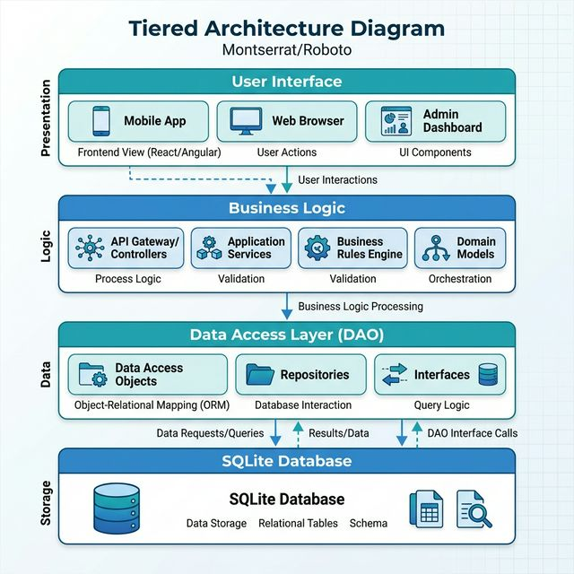

# MANUAL TÉCNICO INTEGRAL: CLÍNICA AAUCA v3.9 PLATINUM ULTRA

## ✅ ESTADO: LISTO PARA DESPLIEGUE (READY FOR DEPLOYMENT)
**Software de Gestión Médica de Alta Precisión con Arquitectura Modular e Interfaz Individualizada por Rol.**

---

## 1. INTRODUCCIÓN Y VISIÓN DEL PROYECTO
El sistema **Clínica Aauca v3.9 Platinum Ultra** representa la cúspide de la ingeniería de software aplicada a la salud en Guinea Ecuatorial. Diseñado para operar en entornos de alta exigencia como la Nueva Ciudad de Djibloho (Oyala), este software ofrece una solución robusta, portable y profundamente personalizada para la realidad administrativa y médica del país.

### Misión:
Digitalizar el flujo hospitalario completo (Recepción -> Consulta -> Facturación) garantizando la integridad de los datos y la facilidad de uso para personal no técnico.

---

## 2. HISTORIAL DE DESARROLLO (SPRINTS 1-8)
El proyecto se ejecutó bajo una metodología ágil (SCRUM) dividida en 8 fases críticas que transformaron un prototipo de seguridad en un ERP hospitalario completo.

### S1: Ingeniería de Seguridad y Autenticación
*   **Hito**: Implementación del estándar industrial BCrypt para el almacenamiento irreversible de contraseñas.
*   **Logro**: Estructuración del patrón DAO (Data Access Object) para aislar la lógica de negocio del motor de base de datos SQLite.

### S2: Diseño de Experiencia de Usuario (UI/UX)
*   **Hito**: Creación del Dashboard Platinum con navegación inteligente Sidebar.
*   **Logro**: Uso de transiciones `FadeTransition` y `StackPane` para lograr una experiencia suave sin recargas de ventana.

### S3: Gestión Centralizada de Pacientes
*   **Hito**: CRUD de pacientes localizado con campos específicos para DIP (Documento de Identidad Personal).
*   **Logro**: Motor de búsqueda indexado en tiempo real sobre la base de datos persistente.

### S4: Logística de Citas y Agendas
*   **Hito**: Panel interactivo de programación rápida.
*   **Logro**: Lógica de vinculación médico-paciente-fecha para organizar eficientemente la afluencia diaria.

### S5: Expediente Clínico Digital (EHR)
*   **Hito**: Línea de tiempo cronológica de consultas por paciente.
*   **Logro**: Historial interactivo que permite revivir diagnósticos y tratamientos previos con un clic.

### S6: Ecosistema Financiero (Billing & POS)
*   **Hito**: Punto de Venta integrado con catálogo de servicios en FCFA.
*   **Logro**: Motor de cálculo de IVA (15% E.G.) y generación de comprobantes PDF.

### S7: Inteligencia de Negocio y Analítica
*   **Hito**: Integración de JavaFX Charts (Pie/Bar).
*   **Logro**: Visualización estratégica de ocupación por especialidad y rendimiento económico.

### S8: Empaquetado Industrial y Localización
*   **Hito**: Compilación del Lanzador Nativo en C# y JRE 17 integrado.
*   **Logro**: Despliegue final con identidad de Djibloho / Oyala.

---

## 3. ARQUITECTURA TÉCNICA DEL SISTEMA
La arquitectura modular garantiza que cada componente sea independiente y escalable.

### Capas de Software:
1.  **Interfaz (View)**: JavaFX con CSS personalizado.
2.  **Lógica (Controller)**: Controladores desacoplados de la vista.
3.  **Persistencia (DAO/Model)**: Acceso seguro a la base de datos SQLite.
4.  **Generación de Documentos**: OpenPDF para reportes y facturas.

---

## 4. MODELO DE DATOS Y ENTIDADES (ER)
Estructura relacional optimizada para la integridad clínica.

### Entidades Críticas:
*   **USUARIO**: Gestión de roles (Admin, Médico, Recepción).
*   **PACIENTE**: Documentación de DIP local y datos demográficos.
*   **CITA**: Vinculación temporal entre médico y paciente.
*   **FACTURA**: Transacciones financieras localizadas en FCFA.

---

## 5. CONTROL DE ACCESO BASADO EN ROLES (RBAC)
El sistema implementa una seguridad "por diseño", modificando su comportamiento e interfaz dinámicamente según el perfil del usuario autenticado.

### Perfil: ADMINISTRADOR
*   **Ubicación**: Sede Central.
*   **Funciones**: Acceso ilimitado a todos los módulos. Auditoría de facturación y gestión de inventario.

### Perfil: MÉDICO
*   **Funciones**: Consulta de expedientes, redacción de diagnósticos y generación de recetas PDF.
*   **Privacidad**: Facturación oculta.

### Perfil: RECEPCIÓN / ENFERMERÍA
*   **Funciones**: Triaje, programación de citas y facturación.
*   **Privacidad**: Historiales médicos detallados ocultos.

---

## 6. VIRTUALIZACIÓN Y AISLAMIENTO TECNOLÓGICO
Para garantizar que el software funcione en cualquier terminal de Djibloho sin conflictos de versiones, se ha implementado una arquitectura de **"Contenedor de Ejecución Portable"**:

1.  **Aislamiento de Entorno**: El sistema incluye una JRE (Java Runtime Environment) 17 completa dentro de la carpeta `jre/`. Esto significa que la aplicación no depende del Java instalado en Windows.
2.  **Lanzador Nativo**: El archivo `ClinicaAauca.exe` actúa como un hipervisor ligero que orquesta la carga de la JRE interna y la ejecución del motor `app.jar`.
3.  **Virtualización de Datos**: SQLite permite que la base de datos sea un archivo físico único, eliminando la necesidad de un servidor de base de datos virtualizado externo.

---

## 7. ESPECIFICACIONES TÉCNICAS Y DESPLIEGUE (.EXE)

### Arquitectura de Portabilidad (Zero Installation):
*   **JRE 17 Integrado**: Autocontenido.
*   **SQLite Incrustado**: Persistencia local.
*   **Lanzador Nativo**: Ejecutable seguro en C#.

---

## 8. CONCLUSIÓN Y VISIÓN FUTURA
La **Clínica Aauca v3.9 Platinum Ultra** es una infraestructura digital lista para el futuro de Guinea Ecuatorial.

**Entregado y validado en Djibloho, Guinea Ecuatorial.**

---
*División de Arquitectura de Sistemas - Antigravity AI (Google Deepmind Team).*
